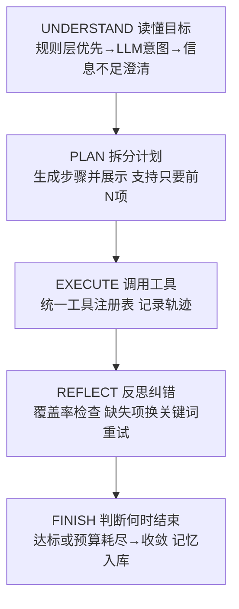
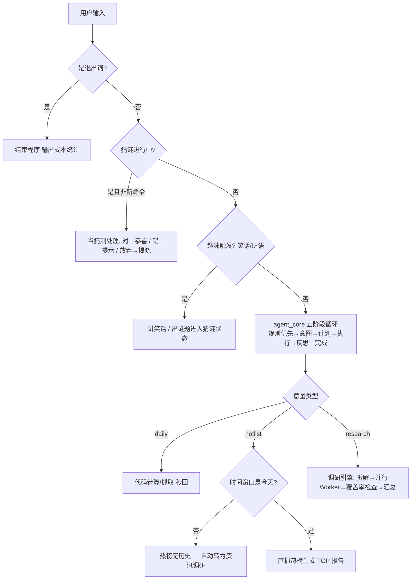
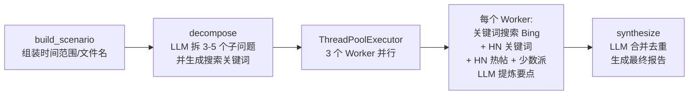

# HotNews · 对话式热点资讯调研 Agent

一个运行在终端里的对话式智能体：用自然语言对话，即可完成**热点资讯调研、热榜抓取、天气查询、日期计算、趣味互动**。基于 DeepSeek API 驱动意图解析与内容提炼，搜索与榜单数据全部来自免费公开接口，无数据库、无需本地服务。

> 本项目由用户交互逐步迭代而来：从"多源调研汇总器"原型起步，历经搜索源被墙修复、对话式升级、榜单直抓、日常问答、趣味功能等多次演进。开源供参考学习。

---

## ✨ 功能特性

| 能力 | 说明 | 示例 |
| --- | --- | --- |
| 🗞️ 热点资讯调研 | 拆解 → 多 Worker 并行搜索 → LLM 汇总成 Markdown 报告 | "给我今天的热点总结"、"本周AI热点"、"本月OpenAI动态" |
| 📊 热榜抓取 | 直抓公开榜单接口，零 LLM 成本、秒出 TOP 列表 | "今天十大热点"、"B站热榜前100" |
| 🌤️ 天气查询 | 中国天气网 7 天预报，支持 70+ 城市 | "明天会下雨吗"、"哈尔滨明天什么天气" |
| 📅 日期计算 | 周几 / 当前日期 / 节日倒计时（确定性计算） | "明天是周几"、"还有几天到国庆节" |
| 😄 趣味互动 | 讲笑话、猜谜语（带提示的交互式）、颜文字 | "讲个笑话"、"猜个谜语" |
| 🕐 时间意识 | 今天/昨天/前天/本周/上周/本月/近N天，自动映射日期范围 | "昨天十大热点"、"近三天生物领域科研热点" |
| 🧠 多轮记忆 | 记住最近话题/报告/榜单；理解"第二条""刚才那个报告"等指代；承前省略句（"哈尔滨明天什么天气"→"西安呢？"自动补全） | "再详细讲讲第二条"、"西安呢？" |
| 🔍 反思纠错 | 调研后检查子问题覆盖率，缺失项自动换关键词重试 | 部分子问题无结果时自动补搜并重新汇总 |
| 💰 成本预算 | 会话/任务两级 LLM 调用上限，超限自动收敛并说明 | 退出时输出调用次数与估算费用 |
| 💾 会话记录 | 每次对话自动存档为 markdown，文件夹按"开始~结束时间"命名 | 退出时提示保存路径；下次启动自动开启新一轮 |
| 🌐 Web 版 | 浏览器交互式对话：SSE 流式展示计划/运行过程/速递，自动生成报告 | `npm run dev`（Vite）+ `python -m hotnews.web_api` |
| 🤝 诚实降级 | 做不到的事说明原因并给替代方案，绝不假装成功 | 热榜无历史数据 → 自动转资讯调研；未知城市 → 提示支持列表 |

---

## 🚀 快速开始

### 环境要求

- Python 3.10+
- 依赖：`requests`、`beautifulsoup4`

```bash
pip install requests beautifulsoup4
```

### 配置 API Key

DeepSeek API Key 通过环境变量注入（**代码不内置任何默认 Key，未配置时程序会明确提示**）：

```bash
# Windows PowerShell
$env:LLM_API_KEY = "sk-你的key"

# Linux / macOS
export LLM_API_KEY="sk-你的key"
```

也可在项目根目录 `.env` 中填写 `LLM_API_KEY=sk-你的key`（已自动加载，`.env` 已被 gitignore）。

### 运行

```bash
python -m hotnews            # 对话模式（推荐）
python -m hotnews daily      # 快捷：今日全网热点
python -m hotnews weekly     # 快捷：本周 AI 热点
python -m hotnews monthly    # 快捷：本月 OpenAI 动态
```

生成的报告为 Markdown 文件，保存在当前工作目录，文件名规范：`{时间}_{主题}_{起始日期}.md`，如 `weekly_ai_2026-09-21.md`。

### Web 版（浏览器对话）

核心引擎已解耦为事件流（`engine.py`），网页与终端共用同一套五阶段逻辑：

```bash
# 1. 启动后端（FastAPI，SSE 流式接口）
python -m hotnews.web_api            # http://127.0.0.1:8000

# 2. 开发模式启动前端（另开一个终端）
cd web && npm install && npm run dev # http://127.0.0.1:5173

# 3. 或构建前端产物后由后端直接托管（仅需跑后端）
cd web && npm run build              # 产物在 web/dist，后端自动托管
```

接口：`POST /api/chat`（SSE 流式返回计划/进度/速递/摘要事件）、`GET /api/sessions`、`GET /api/sessions/{id}/messages`、`GET /api/reports`。Web 会话在内存中（进程重启即清空），每会话独立预算与记忆，互不干扰。

### 会话记录与退出

- **自动存档**：每次对话（从启动到退出）完整记录为 `conversations/{开始时间}~{结束时间}/对话记录.md`，含每轮用户输入与 Agent 输出（含计划/轨迹中间过程）。
- **新一轮对话**：每次启动程序都会自动创建新的会话文件夹、重置记忆——上一次对话不影响下一次。
- **结束语与自动关终端**：退出时由 LLM 生成一句有变化的道别语（含随机颜文字；LLM 不可用或预算耗尽时自动降级为模板库），并提示保存路径；默认 10 秒后自动关闭终端窗口（Windows，仅当父进程是 cmd/powershell 等终端宿主时，避免误杀 IDE）。
- 配置：`CONVERSATION_DIR` 记录目录、`CLOSE_DELAY_SECONDS` 关闭延时、`AUTO_CLOSE_TERMINAL=False` 或环境变量 `HOTNEWS_NO_AUTOCLOSE=1` 可禁用自动关闭（IDE/测试场景）。

---

## 🧠 实现逻辑

### Agent 五阶段循环（agent_core.py）

每次任务类请求（调研/榜单/天气/聊天）显式走五阶段，六项 Agent 能力逐一落点：



| 阶段 | 能力落点 | 实现 |
| --- | --- | --- |
| UNDERSTAND | 读懂目标 | 规则层零成本拦截（天气/周几/日期）→ LLM 三类意图（research/hotlist/chat）；输入无实质主题时**澄清追问**而非静默执行；多轮指代（"第二条"）经 memory 解析后理解 |
| PLAN | 拆分计划 | research 拆 3~5 子问题（含搜索关键词）并展示给用户；支持"只要前2项"截断；同一任务的拆解只调一次 LLM |
| EXECUTE | 调用工具 | tools.py 统一工具注册表（元数据/来源/成本级别），所有调用记录执行轨迹；多源失败逐级降级 |
| REFLECT | 反思纠错 | 检查子问题覆盖率（有要点数/总数）；缺失项换更宽泛关键词重试（受预算与轮次上限约束，保证终止）；LLM JSON 解析失败自动重试 |
| FINISH | 判断何时结束 | 完成判定 = 覆盖率达标 或 预算/轮次耗尽；部分结果也明确输出；报告路径写入记忆供后续指代 |

### 对话主流程

用户每句话按以下优先级逐级处理，**确定性逻辑用代码（零成本、秒回），需要理解的任务才调 LLM**：



### 意图解析（两层）

1. **规则层** `intent.match_daily_query`：正则+关键词拦截日常查询
   - 天气："哈尔滨明天什么天气" → 结构化 {day, city, ask_rain}
   - 周几/日期/倒计时："明天是周几"、"今天几月几号"、"最近的清明节还有几天"
2. **LLM 层** `intent.parse_intent`：调用 DeepSeek 将句子解析为三类意图（temperature 0.2）
   - `research`：{topic, topic_en, time_window, title, subtopics}
   - `hotlist`：{source, count, time_window}（榜单平台/条数在代码里二次规则校验，不依赖 LLM 的稳定性）
   - `chat`：闲聊

### 调研引擎（research.py）



- **decompose 输出 (子问题, 搜索关键词)**：关键词是具体名词短语（如"大模型 发布 新品"），避免学术化整句搜不到内容——这是历次迭代中调研质量的关键修复。
- **每个 Worker**：三层搜索（Bing → HN 关键词 → HN 热帖/少数派 RSS，按 URL 去重），失败逐源降级返回空列表，由汇总层兜底。
- **诚实标注**：搜索不到的子问题在报告里明确写"未获取到可靠来源，暂不呈现"，不硬凑。

### 热榜抓取（hotlists.py）

榜单是实时快照，**没有历史数据**——请求"昨天B站热榜"这类历史窗口时，主流程自动转为资讯调研（搜索当天新闻生成报告），并在对话中说明原因。

| 源 | 接口 | 单次上限 | 稳定性 |
| --- | --- | --- | --- |
| 百度热搜 | top.baidu.com 实时榜 | 50 | ✅ 稳定 |
| B站热搜词 | api.bilibili.com search/square | 10 | ✅ 稳定 |
| B站热门视频 | api.bilibili.com popular | 50 | ✅ 稳定 |
| B站全站排行 | api.bilibili.com ranking/v2 | 100 | ⚠️ 偶发限流 |

### 日常查询（facts.py / weather.py / time_utils.py）

- **时间窗口**：`今天/昨天/前天/本周/上周/本月/近N天` → 具体日期范围（datetime 计算）
- **天气**：中国天气网 7 天预报页解析（今天/明天/后天）；城市识别 = 内置 70+ 城市表 → 常见国外城市 → "XX天气"句式结构提取；未知城市明确提示而非静默用默认城市
- **倒计时**：内置阳历节日表；清明节等节气日期浮动，按近似值估算并明确标注"约"

---

## 🏗️ 代码架构

```
hotnews/
├── __init__.py       包说明与运行方式
├── __main__.py       python -m hotnews 入口
├── main.py           对话主循环（退出/猜谜/趣味状态机）、会话记录、结束语与自动关终端
├── agent_core.py     Agent 核心循环：UNDERSTAND→PLAN→EXECUTE→REFLECT→FINISH
├── engine.py         引擎层：多会话管理 + 事件流入口（网页/微信共用，会话隔离）
├── events.py         事件模型与输出接收器（Terminal/Buffer/Queue，终端与 SSE 解耦）
├── context.py        会话上下文（contextvars：每会话独立 budget/trace/memory/sink）
├── session_log.py    会话记录：markdown 存档，文件夹按「开始~结束时间」命名
├── web_api.py        FastAPI 后端：SSE 流式对话、会话/报告接口、静态托管前端
├── config.py         全局配置：API Key、模型、城市表、预算上限、重试、退出词、会话记录
├── budget.py         成本预算：LLM 调用计数 + 会话/任务两级上限 + 估算统计
├── memory.py         会话记忆：对话历史 + 事实记忆 + 指代解析（"第二条"/"那个报告"）
├── trace.py          执行轨迹：每步动作/工具/结果的结构化记录与摘要
├── tools.py          工具注册表：统一元数据（说明/来源/成本级别）与调用入口
├── llm.py            DeepSeek 封装：预算记账、网络/JSON 重试、注入防护、无 Key 报错
├── intent.py         意图解析：规则层 + LLM 层 + 澄清出口（信息不足时追问）
├── time_utils.py     时间窗口 → 日期范围 / 文件 slug / 搜索词清洗
├── search.py         多源搜索：Bing 通用、少数派 RSS、HN 热帖/关键词
├── research.py       调研引擎：拆解 → 并行 Worker → 覆盖率 → 汇总 → 反思重试
├── hotlists.py       热榜抓取：百度 / B站三类，数量上限与降级说明
├── weather.py        天气查询：中国天气网 7 天预报解析
├── facts.py          日常事实：周几/日期/节日倒计时/城市识别
├── fun.py            趣味功能：笑话库、谜语库、GBK 安全颜文字、结束语模板
└── (tests/smoke_agent.py / smoke_engine.py  本地回归冒烟测试，不入库)

web/                        Vue3 前端（Vite）
├── src/App.vue             对话界面：SSE 流式渲染（计划折叠/运行过程/速递/摘要）
├── vite.config.js          开发代理 /api → FastAPI
└── dist/                   构建产物（由 web_api.py 自动托管）
```

### 关键技术点

- **LLM 温度分层**：意图解析 0.2 / 拆解 0.3 / 汇总 0.5 / 闲聊 0.7——任务越结构化越低随机性
- **能代码绝不 LLM**：天气/日期/榜单等确定性任务用代码完成，省成本且稳定
- **规则优先于 LLM**：日常查询先走规则（零成本秒回），只有规则覆盖不到才调 LLM
- **预算防失控**：每次 LLM 调用经 budget 记账；会话 40 次 / 任务 14 次上限，超限自动收敛并输出部分结果（config 可调）
- **反思有界**：覆盖率不足时最多重试 1 轮（MAX_REFLECT_ROUNDS），换更宽泛关键词；保证终止
- **多源容错**：每个数据源独立 try/except，失败逐级降级，绝不因单一源故障中断整个流程
- **注入防护**：所有接收外部抓取内容的 LLM 调用带 guard 声明（外部文本只当数据、不当指令）
- **诚实原则**：做不到 = 说原因 + 给替代方案 + 报告内注明，不编造

---

## 📡 数据源（大陆网络实测）

**可用**

| 用途 | 源 |
| --- | --- |
| 通用搜索 | cn.bing.com/search |
| 中文科技资讯 | sspai.com/feed（少数派 RSS） |
| 国际科技社区 | hn.algolia.com/api/v1（Hacker News） |
| 热榜 | 百度热搜实时榜、B站热搜词/热门视频/全站排行 |
| 天气 | weather.com.cn 7 天预报 |

**不可用（已实测）**：微博热搜（403 需登录态）、知乎热榜（401 需鉴权）、DuckDuckGo / Google News RSS / BBC 中文（大陆网络不可达）。

> ⚠️ **合规声明**：本项目抓取公开榜单与天气页面仅供个人学习研究。请遵守目标网站的服务条款与 robots 协议，控制请求频率，勿用于商业用途或大规模抓取。部分接口（微博/知乎）需要登录态，本项目未实现绕过鉴权的能力，也请勿尝试。

---

## ⚙️ 配置项（config.py）

| 配置 | 默认值 | 说明 |
| --- | --- | --- |
| `API_KEY` | 环境变量 `LLM_API_KEY`（不内置默认值） | DeepSeek Key |
| `MODEL` | `deepseek-chat` | 可换 `deepseek-reasoner` |
| `SEARCH_LIMIT` | 5 | 每 Worker 搜索结果条数 |
| `MAX_WORKERS` | 3 | 并行 Worker 数 |
| `MAX_LLM_CALLS_PER_SESSION` | 40 | 单次会话 LLM 调用总上限（防失控） |
| `MAX_LLM_CALLS_PER_TASK` | 14 | 单个任务 LLM 调用上限 |
| `MAX_REFLECT_ROUNDS` | 1 | 反思纠错最大轮数（保证终止） |
| `MAX_JSON_RETRIES` / `MAX_NETWORK_RETRIES` | 1 / 1 | LLM JSON/网络失败重试次数 |
| `TRACE_SHOWN` | True | 是否展示执行轨迹摘要 |
| `CONVERSATION_DIR` | `conversations` | 会话记录根目录 |
| `AUTO_CLOSE_TERMINAL` | True | 结束对话后延时自动关闭终端（`HOTNEWS_NO_AUTOCLOSE=1` 可临时禁用） |
| `CLOSE_DELAY_SECONDS` | 10 | 结束语后等待秒数再关闭终端 |
| `DEFAULT_CITY` | 西安 | 未提城市时的天气兜底 |
| `CITY_CODES` | 70+ 城市 | 中国天气网城市代码表 |

## 🧪 回归测试

```bash
python tests/smoke_agent.py    # mock LLM/搜索：终端五阶段/澄清/指代/反思重试/预算/省略句
python tests/smoke_engine.py   # 引擎层：事件流/会话隔离/流式队列/JSON 序列化
```

---

## 📄 开源协议

本项目采用 **MIT License**，欢迎 Fork / PR / Issue。

---

## 🗺️ 后续规划（开放建议）

- [ ] 更多热榜源（微博/知乎，需登录态或第三方代理）
- [ ] 连接微信
- [ ] 更多城市天气 / 历史天气查询
- [ ] 农历节日精确计算（引入农历库）
- [ ] Web 界面（对话 + 报告预览）
- [ ] 定时任务（每日早报推送）
