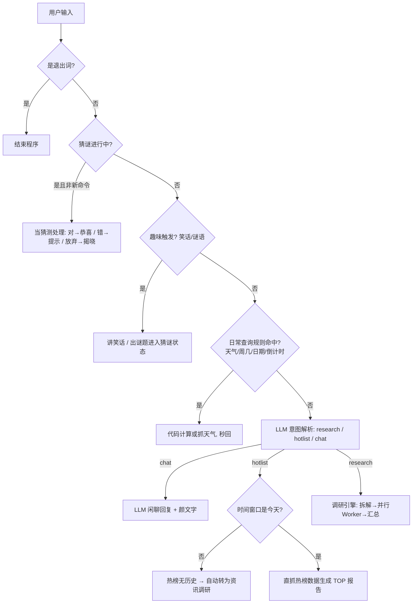
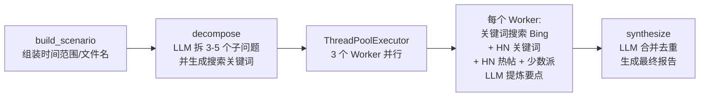

# HotNews · 对话式热点资讯调研 Agent

一个运行在终端里的对话式智能体：用自然语言对话，即可完成**热点资讯调研、热榜抓取、天气查询、日期计算、趣味互动**。基于 DeepSeek API 驱动意图解析与内容提炼，搜索与榜单数据全部来自免费公开接口，无数据库、无需本地服务。

> 本项目由用户交互逐步迭代而来：从"多源调研汇总器"原型起步，历经搜索源被墙修复、对话式升级、榜单直抓、日常问答、趣味功能等多次演进。开源供参考学习。

---

## ✨ 功能特性

| 能力 | 说明 | 示例 |
| --- | --- | --- |
| 🗞️ 热点资讯调研 | 拆解 → 多 Worker 并行搜索 → LLM 汇总成 Markdown 报告 | "给我今天的热点总结"、"本周AI热点"、"本月OpenAI动态" |
| 📊 热榜抓取 | 直抓公开榜单接口，零 LLM 成本、秒出 TOP 列表 | "今天十大热点"、"B站热榜前100" |
| 🌤️ 天气查询 | 中国天气网 7 天预报，支持 70+ 城市 | "明天会下雨吗"、"哈尔滨明天什么天气" |
| 📅 日期计算 | 周几 / 当前日期 / 节日倒计时（确定性计算） | "明天是周几"、"还有几天到国庆节" |
| 😄 趣味互动 | 讲笑话、猜谜语（带提示的交互式）、颜文字 | "讲个笑话"、"猜个谜语" |
| 🕐 时间意识 | 今天/昨天/前天/本周/上周/本月/近N天，自动映射日期范围 | "昨天十大热点"、"近三天生物领域科研热点" |
| 🤝 诚实降级 | 做不到的事说明原因并给替代方案，绝不假装成功 | 热榜无历史数据 → 自动转资讯调研；未知城市 → 提示支持列表 |

---

## 🚀 快速开始

### 环境要求

- Python 3.10+
- 依赖：`requests`、`beautifulsoup4`

```bash
pip install requests beautifulsoup4
```

### 配置 API Key

DeepSeek API Key 通过环境变量注入（**代码内置了测试用的默认值，开源使用请务必删除，见下文"开源安全提醒"**）：

```bash
# Windows PowerShell
$env:LLM_API_KEY = "sk-你的key"

# Linux / macOS
export LLM_API_KEY="sk-你的key"
```

### 运行

```bash
python -m hotnews            # 对话模式（推荐）
python -m hotnews daily      # 快捷：今日全网热点
python -m hotnews weekly     # 快捷：本周 AI 热点
python -m hotnews monthly    # 快捷：本月 OpenAI 动态
```

生成的报告为 Markdown 文件，保存在当前工作目录，文件名规范：`{时间}_{主题}_{起始日期}.md`，如 `weekly_ai_2026-09-21.md`。

---

## 🧠 实现逻辑

### 对话主流程

用户每句话按以下优先级逐级处理，**确定性逻辑用代码（零成本、秒回），需要理解的任务才调 LLM**：



### 意图解析（两层）

1. **规则层** `intent.match_daily_query`：正则+关键词拦截日常查询
   - 天气："哈尔滨明天什么天气" → 结构化 {day, city, ask_rain}
   - 周几/日期/倒计时："明天是周几"、"今天几月几号"、"最近的清明节还有几天"
2. **LLM 层** `intent.parse_intent`：调用 DeepSeek 将句子解析为三类意图（temperature 0.2）
   - `research`：{topic, topic_en, time_window, title, subtopics}
   - `hotlist`：{source, count, time_window}（榜单平台/条数在代码里二次规则校验，不依赖 LLM 的稳定性）
   - `chat`：闲聊

### 调研引擎（research.py）



- **decompose 输出 (子问题, 搜索关键词)**：关键词是具体名词短语（如"大模型 发布 新品"），避免学术化整句搜不到内容——这是历次迭代中调研质量的关键修复。
- **每个 Worker**：三层搜索（Bing → HN 关键词 → HN 热帖/少数派 RSS，按 URL 去重），失败逐源降级返回空列表，由汇总层兜底。
- **诚实标注**：搜索不到的子问题在报告里明确写"未获取到可靠来源，暂不呈现"，不硬凑。

### 热榜抓取（hotlists.py）

榜单是实时快照，**没有历史数据**——请求"昨天B站热榜"这类历史窗口时，主流程自动转为资讯调研（搜索当天新闻生成报告），并在对话中说明原因。

| 源 | 接口 | 单次上限 | 稳定性 |
| --- | --- | --- | --- |
| 百度热搜 | top.baidu.com 实时榜 | 50 | ✅ 稳定 |
| B站热搜词 | api.bilibili.com search/square | 10 | ✅ 稳定 |
| B站热门视频 | api.bilibili.com popular | 50 | ✅ 稳定 |
| B站全站排行 | api.bilibili.com ranking/v2 | 100 | ⚠️ 偶发限流 |

### 日常查询（facts.py / weather.py / time_utils.py）

- **时间窗口**：`今天/昨天/前天/本周/上周/本月/近N天` → 具体日期范围（datetime 计算）
- **天气**：中国天气网 7 天预报页解析（今天/明天/后天）；城市识别 = 内置 70+ 城市表 → 常见国外城市 → "XX天气"句式结构提取；未知城市明确提示而非静默用默认城市
- **倒计时**：内置阳历节日表；清明节等节气日期浮动，按近似值估算并明确标注"约"

---

## 🏗️ 代码架构

```
hotnews/
├── __init__.py       包说明与运行方式
├── __main__.py       python -m hotnews 入口
├── main.py           对话主循环、猜谜状态机、快捷命令、历史榜单自动转调研
├── config.py         全局配置：API Key、模型、城市表、退出词、开场白
├── llm.py            DeepSeek 调用封装（OpenAI 兼容接口，容错 JSON 解析）
├── intent.py         意图解析：日常查询规则层 + LLM 三类意图层
├── time_utils.py     时间窗口 → 日期范围 / 文件 slug / 搜索词清洗
├── search.py         多源搜索：Bing 通用、少数派 RSS、HN 热帖/关键词
├── research.py       调研引擎：拆解 → 并行 Worker → 汇总 → 写报告
├── hotlists.py       热榜抓取：百度 / B站三类，数量上限与降级说明
├── weather.py        天气查询：中国天气网 7 天预报解析
├── facts.py          日常事实：周几/日期/节日倒计时/城市识别
└── fun.py            趣味功能：笑话库、谜语库、GBK 安全颜文字
```

依赖关系（无循环）：

```
config ← llm ← intent ─┐
        ← search ← research ─┼→ main
        ← hotlists ──────────┘
        ← facts ← intent
        ← weather
        ← fun
```

### 关键技术点

- **LLM 温度分层**：意图解析 0.2 / 拆解 0.3 / 汇总 0.5 / 闲聊 0.7——任务越结构化越低随机性
- **能代码绝不 LLM**：天气/日期/榜单等确定性任务用代码完成，省成本且稳定
- **规则优先于 LLM**：日常查询先走规则（零成本秒回），只有规则覆盖不到才调 LLM
- **多源容错**：每个数据源独立 try/except，失败逐级降级，绝不因单一源故障中断整个流程
- **诚实原则**：做不到 = 说原因 + 给替代方案 + 报告内注明，不编造

---

## 📡 数据源（大陆网络实测）

**可用**

| 用途 | 源 |
| --- | --- |
| 通用搜索 | cn.bing.com/search |
| 中文科技资讯 | sspai.com/feed（少数派 RSS） |
| 国际科技社区 | hn.algolia.com/api/v1（Hacker News） |
| 热榜 | 百度热搜实时榜、B站热搜词/热门视频/全站排行 |
| 天气 | weather.com.cn 7 天预报 |

**不可用（已实测）**：微博热搜（403 需登录态）、知乎热榜（401 需鉴权）、DuckDuckGo / Google News RSS / BBC 中文（大陆网络不可达）。

> ⚠️ **合规声明**：本项目抓取公开榜单与天气页面仅供个人学习研究。请遵守目标网站的服务条款与 robots 协议，控制请求频率，勿用于商业用途或大规模抓取。部分接口（微博/知乎）需要登录态，本项目未实现绕过鉴权的能力，也请勿尝试。

---

## ⚙️ 配置项（config.py）

| 配置 | 默认值 | 说明 |
| --- | --- | --- |
| `API_KEY` | 环境变量 `LLM_API_KEY` 优先，内置测试默认值 | DeepSeek Key |
| `MODEL` | `deepseek-chat` | 可换 `deepseek-reasoner` |
| `SEARCH_LIMIT` | 5 | 每 Worker 搜索结果条数 |
| `MAX_WORKERS` | 3 | 并行 Worker 数 |
| `DEFAULT_CITY` | 西安 | 未提城市时的天气兜底 |
| `CITY_CODES` | 70+ 城市 | 中国天气网城市代码表 |

---

## 🔒 开源安全提醒（重要）

`config.py` 中硬编码了一个测试用的 DeepSeek API Key。**开源发布前请务必删除该默认值**，只保留环境变量读取：

```python
# 修改前
API_KEY = os.environ.get("LLM_API_KEY", "sk-这里是测试key，请删除")

# 修改后
API_KEY = os.environ.get("LLM_API_KEY", "")
```

同时建议：

- 在 `.gitignore` 中添加 `.env`、`*.md`（生成的调研报告）等运行时产物
- 若曾将含 Key 的代码推送过远端，请到 DeepSeek 控制台**吊销并重新生成 Key**

---

## 📄 开源协议

本项目采用 **MIT License**，欢迎 Fork / PR / Issue。

---

## 🗺️ 后续规划（开放建议）

- [ ] 更多热榜源（微博/知乎，需登录态或第三方代理）
- [ ] 更多城市天气 / 历史天气查询
- [ ] 农历节日精确计算（引入农历库）
- [ ] Web 界面（对话 + 报告预览）
- [ ] 定时任务（每日早报推送）
